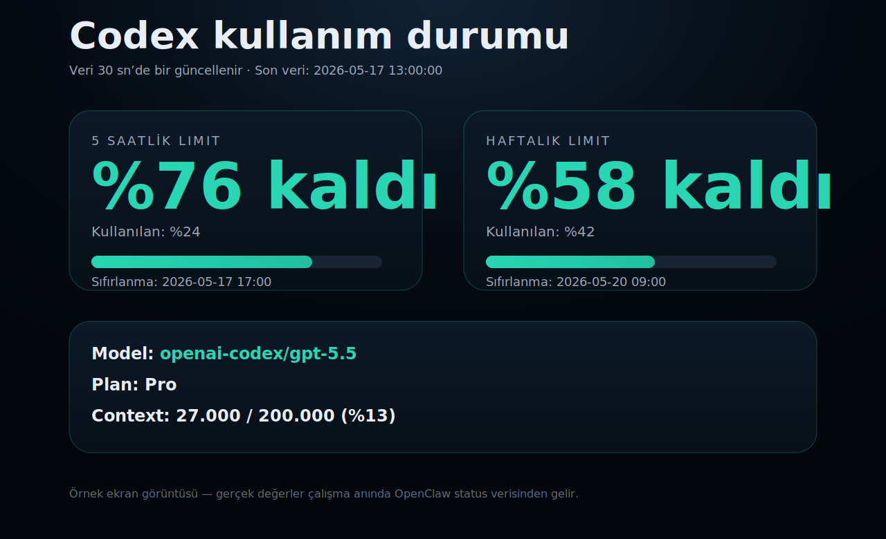

# Codex Usage Web

A small, self-hosted web dashboard for monitoring OpenClaw / Codex usage limits.



## Features

- Shows Codex usage windows and remaining percentage.
- Reads live data from `openclaw status --usage --json`.
- Dark, mobile-friendly single-page UI.
- No database and no external Python dependencies.
- Optional secret URL path for private deployments.

## Requirements

- Python 3.10+
- OpenClaw CLI available as `openclaw`

## Quick start

```bash
git clone https://github.com/tamerbaydag/codex-usage-web.git
cd codex-usage-web
./start.sh
```

Open:

```text
http://127.0.0.1:8787/
```

## Optional configuration

Copy the example env file:

```bash
cp env.example .env
```

Available settings:

```bash
PORT=8787
TZ_NAME=Europe/Istanbul
REFRESH_SECONDS=30
OPENCLAW_BIN=openclaw
# CODEX_USAGE_SECRET=my-secret-path
# OPENCLAW_SESSION_KEY=agent:main:your-session
```

If `CODEX_USAGE_SECRET` is set, the dashboard is served at:

```text
http://127.0.0.1:8787/<CODEX_USAGE_SECRET>
```

## Security

Do **not** commit your `.env`, tokens, tunnel credentials, logs, or runtime pid files.
This repository intentionally includes only public-safe source files.

## Development

The app is intentionally simple:

- `server.py` — HTTP server and dashboard rendering
- `start.sh` — local launcher
- `env.example` — configuration template
- `docs/screenshot.svg` — example screenshot

Pull requests and improvements are welcome.

## License

MIT
